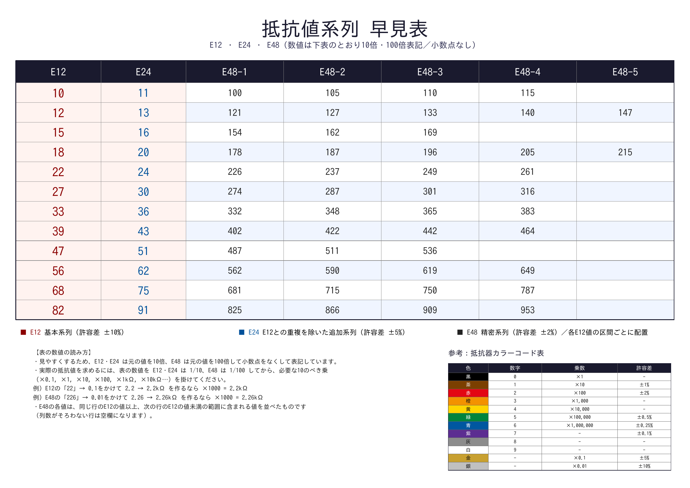

# resistor-poster

抵抗値系列（E12 / E24 / E48）の早見表を、印刷用A2横ポスターPDFとして生成するPythonスクリプトです。



## 特徴

- E12・E24（E12との重複を除いた値のみ）・E48 を1枚の表にまとめて表示
- ポスターとして見やすいよう、小数点をなくして整数表記
  - E12・E24 は元の値の **×10**（例: 2.2 → `22`）
  - E48 は元の値の **×100**（例: 2.26 → `226`）
- E48 の各値は、同じ行の E12 の値以上・次の行の E12 の値未満の範囲で配置
- 補足資料として、抵抗器カラーコード表（数字・乗数・許容差）を併記
- A0〜A4 の用紙サイズに対応（すべて横向き / ランドスケープ）

## 必要環境

- Python 3.9 以降
- [reportlab](https://pypi.org/project/reportlab/)
- 日本語 TrueType フォント（IPAゴシック等）

```bash
pip install -r requirements.txt
```

### 日本語フォントについて

`reportlab` の `TTFont` は TrueType (`.ttf`) のみサポートしており、
Noto Sans CJK のような CFF アウトラインの OpenType (`.ttc` / `.otf`) は
**使用できません**。以下のいずれかを用意してください。

```bash
# Ubuntu / Debian の例
sudo apt-get install fonts-ipafont-gothic
```

スクリプトは以下の順でフォントを自動検出します。

1. `--font-path` で明示的に指定したパス
2. `/usr/share/fonts/opentype/ipafont-gothic/ipag.ttf` など既知の候補
3. `/usr/share/fonts` 以下を `*ipag*.ttf` 等のパターンで検索

見つからない場合はエラーで終了するので、`--font-path` で直接指定してください。

## 使い方

```bash
# デフォルト設定 (A2横向き) で output/resistor_series_poster.pdf に生成
python make_poster.py

# 出力先を指定
python make_poster.py -o dist/poster.pdf

# 用紙サイズを変更 (A0 / A1 / A2 / A3 / A4)
python make_poster.py --pagesize A1

# フォントを明示的に指定
python make_poster.py --font-path /path/to/your-font.ttf
```

### オプション一覧

| オプション | 説明 | デフォルト |
|---|---|---|
| `-o`, `--output` | 出力PDFのパス | `output/resistor_series_poster.pdf` |
| `--pagesize` | 用紙サイズ (`A0`〜`A4`、常に横向き) | `A2` |
| `--font-path` | 使用する日本語TrueTypeフォントのパス | 自動検出 |

## 数値の読み方

表の数値はポスターとしての視認性を優先し、小数点を排して整数化しています。
実際の抵抗値を求めるには、以下の手順で計算してください。

1. 表の数値を **E12・E24 は 1/10**、**E48 は 1/100** する
2. 必要な10のべき乗（×0.1, ×1, ×10, ×100, ×1kΩ, ×10kΩ…）を掛ける

例:
- E12 の `22` → 0.1 倍して `2.2` → ×1000 して `2.2kΩ`
- E48 の `226` → 0.01 倍して `2.26` → ×1000 して `2.26kΩ`

## データを編集する

`make_poster.py` 内の以下の変数を書き換えることで表の内容を調整できます。

- `RESISTOR_ROWS` : E12 / E24 / E48 の各行データ
- `COLOR_CODE_ROWS` : 抵抗器カラーコード表のデータ

## ライセンス

このリポジトリ全体のライセンスに従います。ルートの [LICENSE](../LICENSE)（CC0 1.0 Universal）を参照してください。
